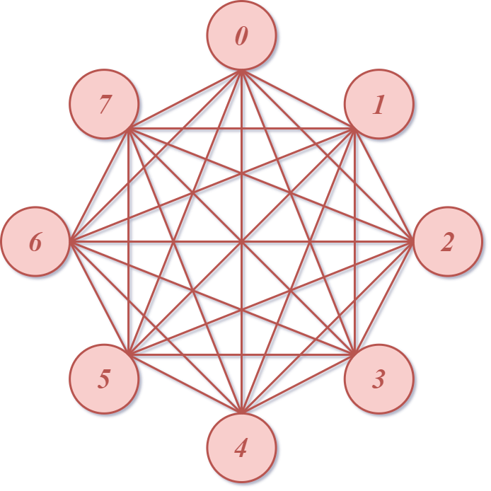
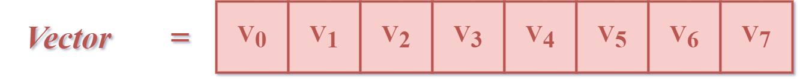
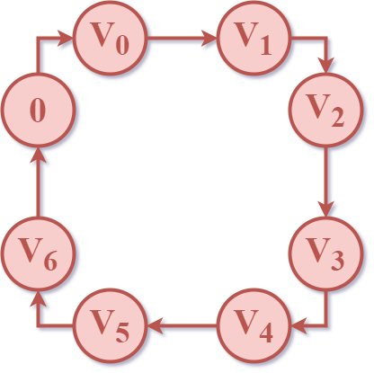
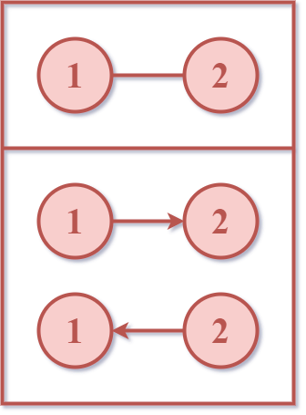

# Gene_Algo_.Net

**RU**
## Описание
- Предмет: Технологическая практика по "Объектно-ориентированное программирование на платформе .NET" осень 2024
- Выполнил: студент 4 курса ВМК МГУ, Дорофеев А.

## Постановка задачи
**Задача коммивояжёра (или TSP от англ. Travelling Salesman Problem)** [[Wiki](https://ru.wikipedia.org/wiki/Задача_коммивояжёра)]
> 

> *Коммивояжёр (муж.)* - разъездной агент крупной торговой фирмы, предлагающий товары по образцам, каталогам, прейскурантам.
>
> `Толковый словарь Ожегова. С.И. Ожегов, Н.Ю. Шведова. 1949-1992.`

---

> [!IMPORTANT]
> Задана симметричная квадратная матрица расстояний между $N$ городами $D=\{d_{ij}\}\in R^{N \times N}; \quad d_{ij}=d_{ji}>0; \quad d_{ii}=0$. Требуется найти близкий к кратчайшему маршрут, проходящий по одному разу через все указанные города с возвратом в исходный город. 
>
> В качестве множества решений задачи можно взять множество всех перестановок первых $N$ натуральных чисел. Каждый экземпляр решения определяет порядок посещения городов. Более приспособленным является экземпляр с меньшей длиной маршрута. Мутация - перестановка двух элементов экземпляра.

## Интересные факты

Задача коммивояжёра относится к числу [трансвычислительных](https://ru.wikipedia.org/wiki/Трансвычислительная_задача): уже при относительно небольшом числе городов (>66) она не может быть решена методом перебора вариантов никакими теоретически мыслимыми компьютерами за время, меньшее нескольких миллиардов лет.

## Технологии
1. С#, .NET

# Генетический алгоритм
-

# Пример

> В качестве примера рассмотрим случай `8 городов`.
>
> С математической точки зрения задача представляет собой поиск [гамильнова цикла](https://ru.wikipedia.org/wiki/Гамильтонов_граф) в [полном графе](https://ru.wikipedia.org/wiki/Полный_граф).
> 

> ### Граф (для случая 8 городов)
>
> 
> 

> [!TIP]
>
> *Интересный факт*
> 
> Изображения полных графов, вершины которых располагаются в вершинах правильных многоугольников, иногда называют [мистическими розами](https://nrich.maths.org/problems/mystic-rose).

> ### Матрица смежности (для случая 8 городов)
> Пусть дана следующая матрица смежности:
> | $i/j$ | `0` | `1` | `2` | `3` | `4` | `5` | `6` | `7` |
> | --- | --- | --- | --- | --- | --- | --- | --- | --- |
> | `0` | ***0*** | 7 | 6 | 5 | 4 | 3 | 2 | 1 |
> | `1` | 7 | ***0*** | 7 | 6 | 5 | 4 | 3 | 2 |
> | `2` | 6 | 7 | ***0*** | 7 | 6 | 5 | 4 | 3 |
> | `3` | 5 | 6 | 7 | ***0*** | 7 | 6 | 5 | 4 |
> | `4` | 4 | 5 | 6 | 7 | ***0*** | 7 | 6 | 5 | 
> | `5` | 3 | 4 | 5 | 6 | 7 | ***0*** | 7 | 6 |
> | `6` | 2 | 3 | 4 | 5 | 6 | 7 | ***0*** | 7 |
> | `7` | 1 | 2 | 3 | 4 | 5 | 6 | 7 | ***0*** |

<!-- > ### Раcсчёты
> Количество рёбер - `edges`
>
> $edges = \displaystyle\sum_{i=1}^{N-1}i=\frac{N\cdot(N-1)}{2} \Rightarrow$ при
> $N=8, \quad edges = \displaystyle\sum_{i=1}^{7}i=\frac{8\cdot7}{2}=28.$ -->

> ### Решение
> Т.к. решение задачи представляет собой поиск гамильтонова цикла, то не уменьшая общности будем считать,
> что `коммивояжёр` отправляется из города `0`.
>
> Тогда в качестве экземпляра решения можно принять `Vector` $ \in R^{1 \times N}$, где $V_i$ - номер города, в который отправляется `коммивояжёр` на  `i-ом` шаге.
>
> 
> 
> Получившийся цикл:
> 
> 
>
> Нетрудно заметить, что при данных условиях $V_7 = 0 \Rightarrow$ цикл примет вид:
> 
> 
> 
> Таким образом, если зафиксировать факт: `начала-конца цикла в городе 0`, то можно уменьшить размер `Vector`
> до $1 \times N-1$, т.е. в данной задаче:  $1 \times 7$
> 
> 
>

> [!NOTE]
>
> *Примечание*
>
> Решения для других *стартовых* городов могут быть полчуны из данного с точностью до перестановки.

## Алгоритмическая сложность
> В рассматриваемой нами задаче в самом  начале своего путешествия `коммивояжёр` всегда находится в городе `0` и ему требуется посетить ещё $(n-1)$ город (т.е. города: $1,..,n$).
>
> `N` - количество городов.
>
> Разберём по шагам:
> | № шага | Количество вариантов *куда пойти дальше*  |
> | :----: | :---------------------------------------: |
> | $0$ | $(N-1)$ |
> | $1$ | $(N-2)$ |
> | $2$ | $(N-3)$ |
> | $3$ | $(N-4)$ |
> | $4$ | $(N-5)$ |
> | $5$ | $(N-6)$ |
> | $6$ | $(N-7)$ |
> 
> Несложным подсчётом получаем, что общее количество вариантов:
> $P = (N-1)\cdot(N-2)\cdot(N-3)\cdot {}\dots{} \cdot 2\cdot1 = (N-1)!$
> > [!CAUTION]
> >
> > Т.к. наша задача симметрична и граф не является [орграфом](https://ru.wikipedia.org/wiki/Граф_(математика)),
> > то при подсчёте общего количества вариантов мы учли все рёбра дважды (см. рисунок ниже).
> >
> >  

>
> Таким образом сложность алгоритма (количество вариантов, которые следует рассмотреть при решении полным перебором):
>
>  $\displaystyle O(n) = \frac{P}{2} = \frac{(N-1)!}{2}$ 
>

> [!TIP]
> *Интересный факт*
> 
> Задача коммивояжёра относится к классу [NP-полных задач](https://ru.wikipedia.org/wiki/NP-полная_задача).
> 
> Дополнительная информация и эвристики позволяют за приемлемое время находить приемлемые решения.

## Лицензия
[GNU General Public License v3.0](https://www.gnu.org/licenses/gpl-3.0.html)

